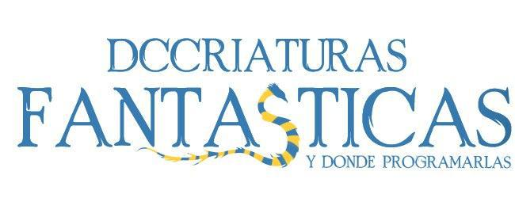

# Tarea 01: DCCriaturas Fantásticas 

## Consideraciones generales :warning:
* La plataforma comienza bien, da la bienvenida y ofrece las opciones de crear magizoólogo, cargar magizoólogo y salir. En cuanto al registro de un usuario, al crear uno nuevo, se dan las opciones de tipo de magizoólogo, donde no se da la opción de volver atrás ni salir. En la elección de la criatura, tampoco se da la opción de volver atrás ni de salir. Cuando hay un error en el nombre, se avisa, y vuelve a la elección de la especie.
En el caso de cargar un magizoólogo se analiza la existencia de ese nombre, por lo que si no es alfanúmerico se dirá que no existe ese usuario, ya que el filtro de nombre es al crearlo.

* La actualización de archivos, que se puede encontrar como función en ```cargar.py``` se ejcuta cuando al finalizar una acción, por lo que no guarda acciones realizadas a medias.

* En el archivo ```DCC.py``` se define ```self.usuario``` que corresponde a la instancia del magizoologo que tiene la sesión iniciada y ```self.mis_criaturas``` como la instancia de las criaturas del magizoologo de la sesión, de manera de trabajar con nombres más cortos. En  ```magizoologos.py``` se realiza lo mismo para la criatura elegida con ```self.criat_elegida```.

* La aprovación del magizoologo al no estar en los archivos, cuando se cierra la sesión y se muestra el estado, va a aparecer que está en 0 y se actualizará cuando pase el dia. Esto no tiene ninguna implicancia, ya que la licencia si fue quitada con anterioridad seguirá así, y si tiene en ese momento serguirá teniendo aunque salga arpovación 0. 

* En la prueba del programa no se encontraron caídas de este mismo. 

### Cosas implementadas y no implementadas :heavy_check_mark: :x:

* **OOP**:
    * **Diagrama**: Hecho completo.
    * **Clases, atributos, metodos**: Hecho completo.
    * **Relación entre clases**: Hecho completo.
* **Partidas**:
    * **Crear partida**: Hecho completo.
    * **Cargar partida**: Hecho completo.
* **Acciones**:
    * **Cuidar DCCriaturas**: Hecho completo.
    * **DCC**: Hecho completo.
    * **Pasar día**: Hecho completo. 
* **Consola**:
    * **Menús**: Hecho completo.
* **Archivos**:
    * **Archivos .csv**: Hecho completo.
    * **parametros.py**: Hecho completo.
* **Bonus**:
    * **SuperMagizoólogo**: No hecho.
    * **Pelea entre DCCriaturas**: Hecho completo. 
   
   


## Ejecución :rewind: :arrow_forward: :fast_forward:
El módulo principal de la tarea a ejecutar es  ```main.py```. Además se deben tener los siguentes archivos:
1. ```magizoologos.csv``` en ```directorio```.
2. ```criaturas.csv``` en ```directorio```.


## Librerías :books:
### Librerías externas utilizadas :closed_book:
La lista de librerías externas que utilicé fueron las siguientes:

1. ```random```: ```random.random()```, ```random.randint()```. 
2. ```abc```: ```ABC```, ```abstractmethod``` .
3. ```sys``` : ```exit()```.

### Librerías propias :notebook:
Por otro lado, los módulos que fueron creados fueron los siguientes:

1. ```parametros.py```: Contiene a todos los parámetros utilizados en el código. En todos los módulos se utilizarán de la forma ```p.NOMBRE_PARAMETRO``` menos en ```cargar.py```.

2. ```criaturas.py```: Contiene a la clase abstracta ```Criatura```, de la cual se hereda ```Augurey```, ```Niffler```, ```Erkling```. Se utiliza poliformismo para mandarselo al DCC para ver estado. El metodo ```archivar``` es para mandar la información a la función ```actualizar_archivos``` de ```cargar.py```. Se importa el módulo ```paramentros.py```. Antes de las clases se define una función ```str_a_bool``` para convertir de strings a bool los bools que son pedidos.

3. ```magizoologos.py```: Contiene a la clase abstracta ```Magizoologo```, de la cual se hereda ```Docencio```, ```Tareo```e ```Hibrido```. Se utilza poliformismo y metodo ```archivar``` para el mismo fin que ```criaturas.py```. Se maneja alimentos como una lista. Se define la habilidad especial como abstractmethod, para despúes definirla en cada clase; se establecen también las properties para los sickles y la energía. se importan todas las clases de especies y la función ```str_a_bool``` de ```criaturas.py```; y los parametros de ```parametros.py```.

4. ```cargar.py```: Se definen las funciones para cargar los archivos ```Magizoologos.csv``` y ```Criaturas.csv```. Además se define una función para mantenerlos actualizados. Se importan las clases de los tipos de magizoologos de ```magizoologos.py```, las especies de criaturas de ```criaturas.py``` y la ruta de ```criaturas.csv``` de parametros para incorporar las criaturas propias de cada magizoologo.

5. ```DCC.py```: Se define la única clase DCC la cual tiene los métodos correspondientes. Se utliza el poliformismo ```__str__``` para establecer el estado del magizoologo y sus criaturas. Además es en esta clase que se crea el metodo de ```pelea``` del bonus. En este archivo se ejecutan las funciones de ```cargar_magizoologos``` y ```cargar_criaturas``` del módulo ```cargar.py```. Se adoptan criaturas en el metodo ```vender_criaturas```, se venden alimentos en ```vender_alimentos``` se paga al magizoologo en ```pago``` y se deinen las multas en ```fiscalizar```. Se importan las funciones de cargar archivos mencionadas anteriormente, las especies de criaturas, los párametros, las librerías ```sys``` y ```random```.

6. ```Menu.py```: Contiene a la clase MenuInicio de la que heredan todos los menú. En este módulo contiene principalmente las opciones del menú (los strings de cada uno) y la robustez en caso de errores del usuario. Además se presentan los métodos de ```crear_magizoolog``` y ```cargar_magizoologo```. Importa a todos los módulos descritos anteriormente menos ```cargar.py``` ya que importa la ejecución de ese módulo realizada en ```DCC.py```; además importa las librerías ```sys``` y ```random```.


## Supuestos y consideraciones adicionales :memo:
Los supuestos que realicé durante la tarea son los siguientes:

1. Los magizoólogos realizan sus efectos al alimentar las criaturas, posterior a está acción. Por ejemplo, Docencio le sube la salud total a la criatura después de alimentarla.

2. Solo se pueden realizar acciones sobre una criatura si está en cautiverio. 

3. Se fiscaliza aunque no tenga la licencia de magizoologo, y se hacen los mismos cobros.

4. Cuando se rechaza el buñuelo, la criatura también puede atacar al magizoólogo.

5. Las acciones de alimentar, recuperar y sanar primero revisarás si tienen la energía para hacerlas y posteriormente se ejecutan.

6. Para la aprovación se calculara la parte entera de la división para poder asi interpretarlo como int.

-------


## Referencias de código externo :link:

Para la realización de la tarea no hubo utilización de códigos externos.